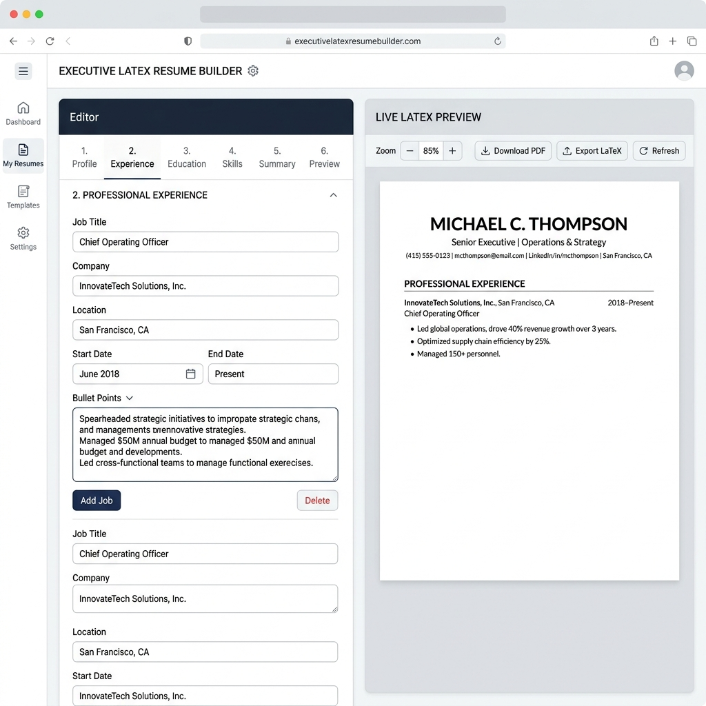

# 🚀 CareerPilot — AI-Powered Candidate Career Acceleration Platform

<p align="center">
  
</p>

<p align="center">
  
  
  
  
  
  
  
</p>

---

## 📖 Table of Contents
- [🌐 Project Overview](#-project-overview)
- [🌟 Complete Feature Suite & Screenshots](#-complete-feature-suite--screenshots)
- [📊 Interactive Dashboard & Screener Preview](#-interactive-dashboard--screener-preview)
- [🎬 UI Animation & Visual Design Engine](#-ui-animation--visual-design-engine)
- [🏗 System Architecture & Flow](#-system-architecture--flow)
- [🛠 Technology Stack](#-technology-stack)
- [💻 Local Development Setup](#-local-development-setup)
- [☁️ AWS Production Cloud Architecture](#%EF%B8%8F-aws-production-cloud-architecture)
- [🛡️ Production Hardening & Resilience](#%EF%B8%8F-production-hardening--resilience)
- [📜 License & Author](#-license--author)

---

## 🌐 Project Overview

**CareerPilot** is a comprehensive, enterprise-grade **AI candidate career acceleration suite**. It empowers candidates to optimize their job application lifecycle through **ATS resume scorecards**, **executive LaTeX PDF compiling**, **AI voice mock interviews**, **CS core subject trackers**, and **real-time live job matching**.

Powered by Google's **Gemini AI**, **scikit-learn TF-IDF similarity vectorizers**, and an ultra-fluid **React 19 / Vite 7** frontend, CareerPilot provides instant feedback, bullet point optimization, and candidate scoring.

---

## 🌟 Complete Feature Suite & Screenshots

### 1. 📊 ATS Resume Screener & Skill Alignment Engine
- **Instant Match Scorecard (0–100%)**: Evaluates uploaded `PDF` and `DOCX` CVs against target job descriptions using scikit-learn TF-IDF cosine similarity.
- **ATS Parser Compatibility**: Simulates Workday, Greenhouse, and Lever parsing engines to detect formatting flaws and keyword gaps.
- **Gemini AI Skill Booster**: Recommends missing hard/soft technical skills and contextual action verbs to maximize interview call rates.
- 📁 **Source Code**: [Upload.jsx](file:///c:/Users/Mukund/PycharmProjects/Resume_Screener/client/src/pages/Upload.jsx), [Result.jsx](file:///c:/Users/Mukund/PycharmProjects/Resume_Screener/client/src/pages/Result.jsx), [views.py](file:///c:/Users/Mukund/PycharmProjects/Resume_Screener/backend/api/views.py)

<p align="center">
  
</p>

### 2. 📈 Interactive Candidate Dashboard & Score Analytics
- **Centralized Metrics**: Displays historical ATS scores, resume versions, DSA tracker progress, and mock test performances.
- **1-Click PDF Report Export**: Generates and downloads a complete candidate diagnostic PDF report containing detailed analytics.
- 📁 **Source Code**: [dashboard.jsx](file:///c:/Users/Mukund/PycharmProjects/Resume_Screener/client/src/pages/dashboard.jsx)

<p align="center">
  
</p>

### 3. 📄 Executive LaTeX Resume Builder & PDF Compiler
- **3 Executive Templates**: Tailored for Software Engineering, Data Science / ML, and Product/Executive roles.
- **AI Bullet Enhancer**: Automatically converts draft notes into high-impact LaTeX bullet points using Google Gemini AI.
- **Direct Export**: One-click download as high-converting compiled `.pdf` or editable `.docx`.
- 📁 **Source Code**: [ResumeBuilder.jsx](file:///c:/Users/Mukund/PycharmProjects/Resume_Screener/client/src/pages/ResumeBuilder.jsx), [Preview.jsx](file:///c:/Users/Mukund/PycharmProjects/Resume_Screener/client/src/pages/Preview.jsx), [MakerOptions.jsx](file:///c:/Users/Mukund/PycharmProjects/Resume_Screener/client/src/pages/MakerOptions.jsx)

<p align="center">
  
</p>

### 4. 🎙️ AI Voice Mock Interviews & Fluency Analytics
- **Speech-to-Text Analytics**: Practice technical & behavioral interview questions with real-time speech analytics.
- **Fluency & Accuracy Scoring**: Evaluates candidate confidence, pacing, domain accuracy, and filler words.
- **Automated Roadmap Generator**: Delivers a personalized study plan targeting identified technical weak points.
- 📁 **Source Code**: [Preparation.jsx](file:///c:/Users/Mukund/PycharmProjects/Resume_Screener/client/src/pages/Preparation.jsx), [MockTest.jsx](file:///c:/Users/Mukund/PycharmProjects/Resume_Screener/client/src/pages/MockTest.jsx)

<p align="center">
  
</p>

### 5. 📚 CS Core Subjects & Top 50 DSA Sheet Tracker
- **Subject Theory Revision**: In-depth notes for Operating Systems (OS), Database Management Systems (DBMS), Computer Networks (CN), System Design, and Object-Oriented Programming (OOPs).
- **Top 50 DSA Sheet**: Track solved algorithm problems with direct links to LeetCode and GeeksforGeeks.
- 📁 **Source Code**: [OsTheory.jsx](file:///c:/Users/Mukund/PycharmProjects/Resume_Screener/client/src/pages/OsTheory.jsx), [DbmsTheory.jsx](file:///c:/Users/Mukund/PycharmProjects/Resume_Screener/client/src/pages/DbmsTheory.jsx), [CnTheory.jsx](file:///c:/Users/Mukund/PycharmProjects/Resume_Screener/client/src/pages/CnTheory.jsx), [SystemDesignTheory.jsx](file:///c:/Users/Mukund/PycharmProjects/Resume_Screener/client/src/pages/SystemDesignTheory.jsx), [OopsTheory.jsx](file:///c:/Users/Mukund/PycharmProjects/Resume_Screener/client/src/pages/OopsTheory.jsx)

### 6. 💼 Real-Time Live Job Matcher
- **100K+ Live Job Index**: Aggregates tech roles updated daily via Arbeitnow & JSearch APIs.
- **Skill-Graph Alignment**: Automatically filters roles based on extracted candidate resume skills, remote preferences, and location hubs.
- 📁 **Source Code**: [Jobs.jsx](file:///c:/Users/Mukund/PycharmProjects/Resume_Screener/client/src/pages/Jobs.jsx)

### 7. 🤖 Conversational AI Career Coach & Resume Assistant
- **Interactive Career Guidance**: Dedicated AI chatbot assisting with resume tailoring, interview question prep, and career path recommendations.
- 📁 **Source Code**: [Chatbot.jsx](file:///c:/Users/Mukund/PycharmProjects/Resume_Screener/client/src/pages/Chatbot.jsx)

### 8. 🔐 Multi-Provider Authentication & Security
- **Secure Access**: Email OTP verification, Google Identity One-Tap OAuth integration, protected frontend routing, and JWT session handling.
- 📁 **Source Code**: [Login.jsx](file:///c:/Users/Mukund/PycharmProjects/Resume_Screener/client/src/pages/Login.jsx), [AuthContext.jsx](file:///c:/Users/Mukund/PycharmProjects/Resume_Screener/client/src/contexts/AuthContext.jsx)

---

## 📊 Interactive Dashboard & Screener Preview

> [!NOTE]
> Below is the candidate scorecard and diagnostic profile output generated after analyzing an uploaded resume against target job requirements:

```carousel

<!-- slide -->

<!-- slide -->

<!-- slide -->

<!-- slide -->

```

---

## 🎬 UI Animation & Visual Design Engine

The landing page ([Home.jsx](file:///c:/Users/Mukund/PycharmProjects/Resume_Screener/client/src/pages/Home.jsx)) features an executive-grade interactive UI built with modern animation libraries:

- **Framer Motion (`framer-motion`)**: Scroll-triggered transforms (`useScroll`, `useTransform`, `useSpring`), hero element floating, micro-interactions, badge glows, and component entrances.
- **Lenis Smooth Scroll (`lenis`)**: Inertial momentum-based smooth scrolling across all pages.
- **HTML5 Neural Particle Mesh (`ParticleMeshCanvas`)**: Custom HTML5 2D Canvas engine generating an interactive neural particle network that connects nodes dynamically on cursor hover.
- **3D Perspective Tilt Engine (`TiltCard`)**: Custom CSS 3D perspective engine (`perspective(1000px) rotateX(...) rotateY(...) scale3d(...)`) with a specular glare effect following cursor coordinates.
- **Glassmorphic HSL Design System**: Dark/light mode theme engine built with backdrop blur filters (`backdrop-filter: blur()`) and dynamic HSL gradients ([home.css](file:///c:/Users/Mukund/PycharmProjects/Resume_Screener/client/src/css/home.css)).

---

## 🏗 System Architecture & Flow

```mermaid
flowchart TD
    User([Candidate / Recruiter]) -->|HTTPS Requests| CloudFront[AWS CloudFront CDN / S3]
    User -->|API / Web Traffic| Nginx[Nginx 1.28.3 Reverse Proxy]
    
    subgraph AWS EC2 Server (t3.small / 2GB RAM / 20GB SSD)
        Nginx -->|Static Assets /assets/| Dist[Client Static Build /client/dist/]
        Nginx -->|Proxy Pass http://127.0.0.1:8000| Gunicorn[Gunicorn WSGI / 3 Workers 2 Threads]
        
        subgraph Django REST Backend
            Gunicorn --> Django[Django 5.0 REST Framework]
            Django --> Auth[Authentication & JWT Engine]
            Django --> TFIDF[Scikit-Learn TF-IDF Cosine Similarity]
            Django --> PDFCompiler[PDFPlumber & PyPDF2 Parser]
            Django --> DB[(SQLite / PostgreSQL DB)]
        end
    end
    
    Django -->|API Calls| Gemini[Google Gemini 2.5 Flash AI API]
    Django -->|API Calls| JobAPI[Arbeitnow / JSearch Live Job APIs]
```

---

## 🛠 Technology Stack

| Layer | Technologies & Tools |
| :--- | :--- |
| **Frontend** | React 19, Vite 7, TailwindCSS 4, Framer Motion, Lenis Smooth Scroll, GSAP, Lucide Icons |
| **Backend** | Python 3.12, Django 5.0 REST Framework, Gunicorn WSGI |
| **AI & Machine Learning** | Google Gemini 2.5 Flash API, `scikit-learn` (TF-IDF vectorizer), `pandas`, `numpy` |
| **Parsing & Compilers** | `pdfplumber`, `PyPDF2`, `python-docx`, `fpdf2`, LaTeX engine |
| **Database** | SQLite (Development) / PostgreSQL (Production) |
| **Cloud & Infrastructure** | AWS EC2 (`t3.small`, 2GB RAM, 20GB SSD), Nginx Reverse Proxy, Static Elastic IP `15.252.51.16` |

---

## 💻 Local Development Setup

### 1. Clone Repository
```bash
git clone https://github.com/mukundkhandelwal463/careerpilot.git
cd careerpilot
```

### 2. Backend Setup (Django)
```bash
# Create Python virtual environment
python -m venv .venv

# Activate environment
source .venv/bin/activate  # On Windows: .venv\Scripts\activate

# Install dependencies
pip install -r backend/requirements.txt

# Create .env file
cp backend/.env.example backend/.env
# Open backend/.env and add your GEMINI_API_KEY

# Run database migrations & start backend server
python backend/manage.py migrate
python backend/manage.py runserver 8000
```

### 3. Frontend Setup (React / Vite)
```bash
cd client
npm install
npm run dev
```
Open [http://localhost:5173](http://localhost:5173) in your browser.

---

## ☁️ AWS Production Cloud Architecture

CareerPilot is deployed on **AWS Cloud** using an optimized, high-availability architecture:

- **Server Instance**: AWS EC2 `t3.small` (2 GB RAM, 20 GB SSD)
- **Static IP**: AWS Elastic IP `15.252.51.16` permanently bound
- **WSGI Server**: Gunicorn 3 workers × 2 threads (`--workers 3 --threads 2 --timeout 120`)
- **Reverse Proxy**: Nginx 1.28.3 with direct static asset caching for `/assets/`
- **Deployment Script**: [ec2-userdata.sh](file:///c:/Users/Mukund/PycharmProjects/Resume_Screener/ec2-userdata.sh)

---

## 🛡️ Production Hardening & Resilience

1. **2 GB Swap Memory Protection**: `/swapfile` enabled to buffer RAM spikes.
2. **Systemd Auto-Recovery**: Configured `Restart=always` with `RestartSec=3` for automatic service recovery.
3. **High File Handle Limits**: Updated `LimitNOFILE=65535` and Nginx `worker_rlimit_nofile 65535` to prevent socket dropouts.
4. **100MB Log Vacuum Capping**: Configured `/etc/systemd/journald.conf` with `SystemMaxUse=100M` to prevent disk bloat.

---

## 📜 License & Author

Distributed under the **MIT License**. See `LICENSE` for details.

**Author**: Mukund Khandelwal ([GitHub Profile](https://github.com/mukundkhandelwal463))  
**Project Repository**: [CareerPilot on GitHub](https://github.com/mukundkhandelwal463/careerpilot)

---

<p align="center">
  <b>Built with ❤️ for candidate career acceleration.</b>
</p>
