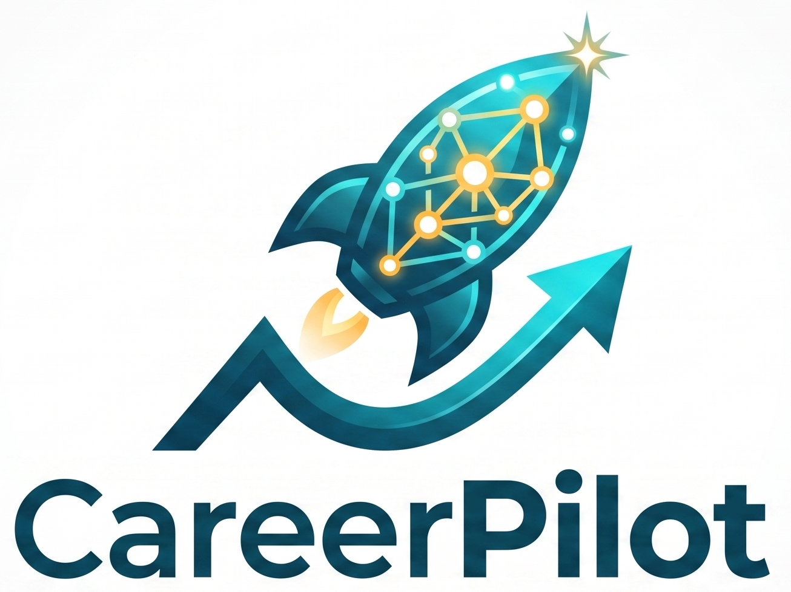
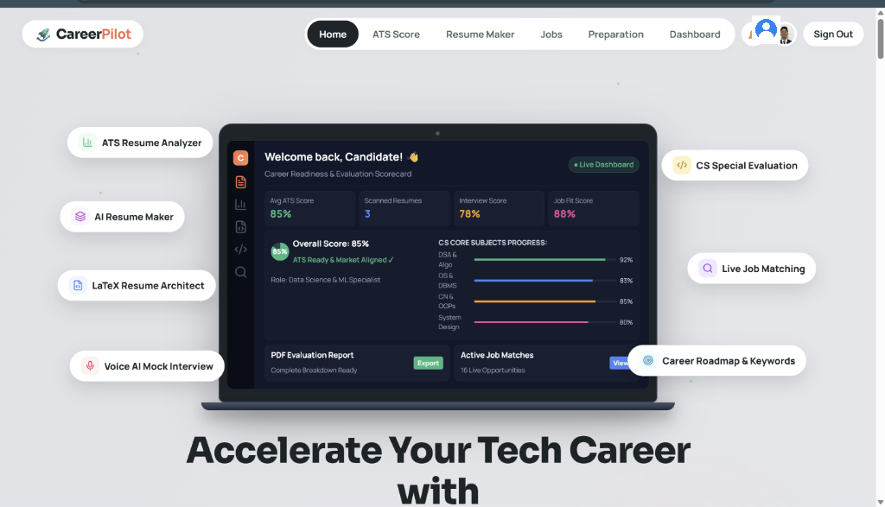
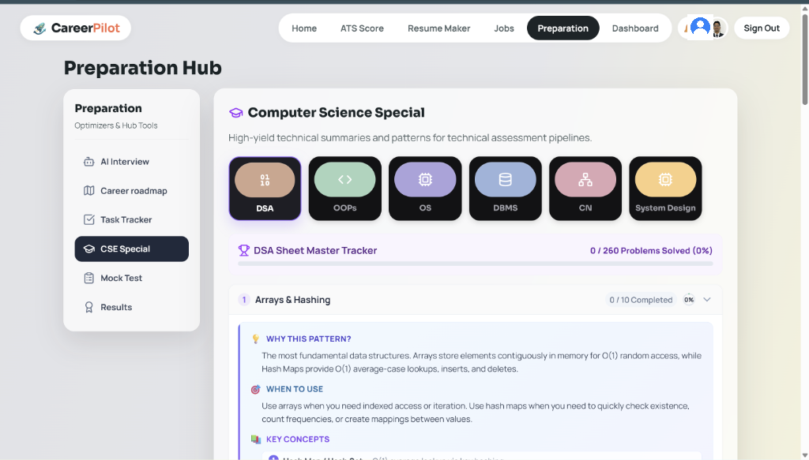
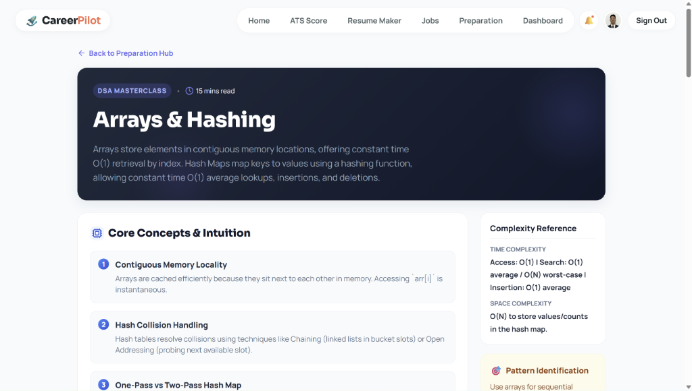
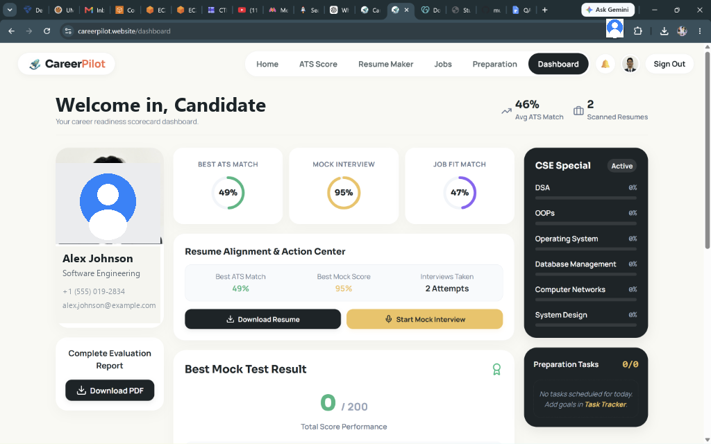
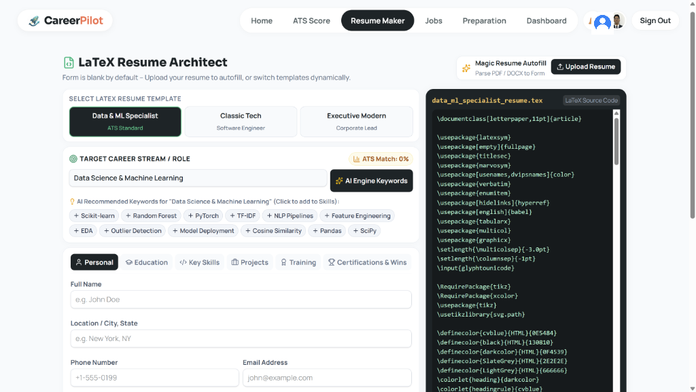
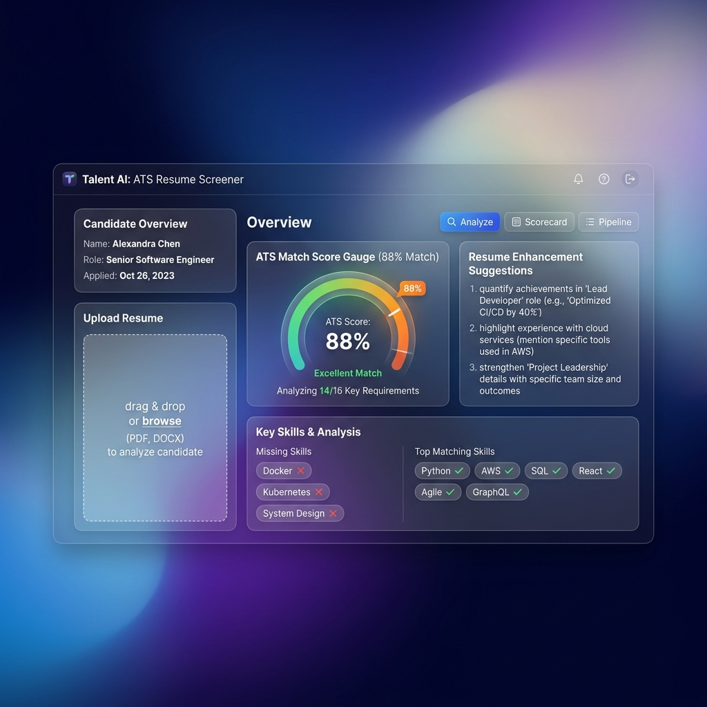
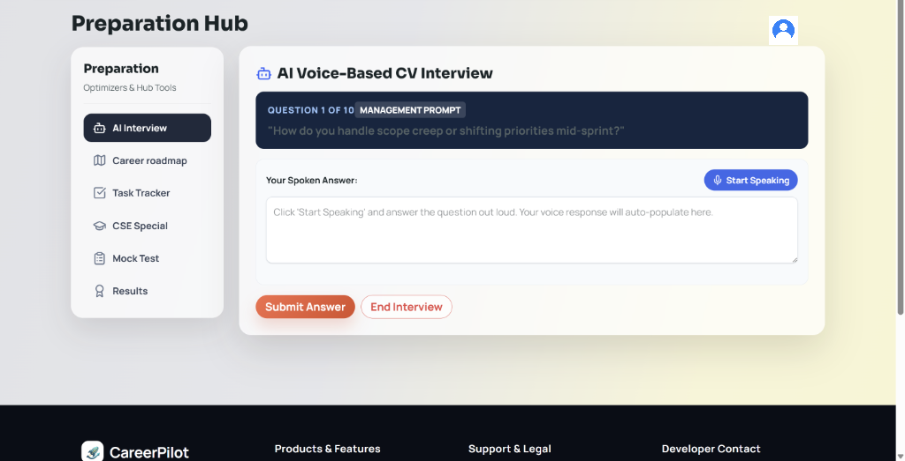
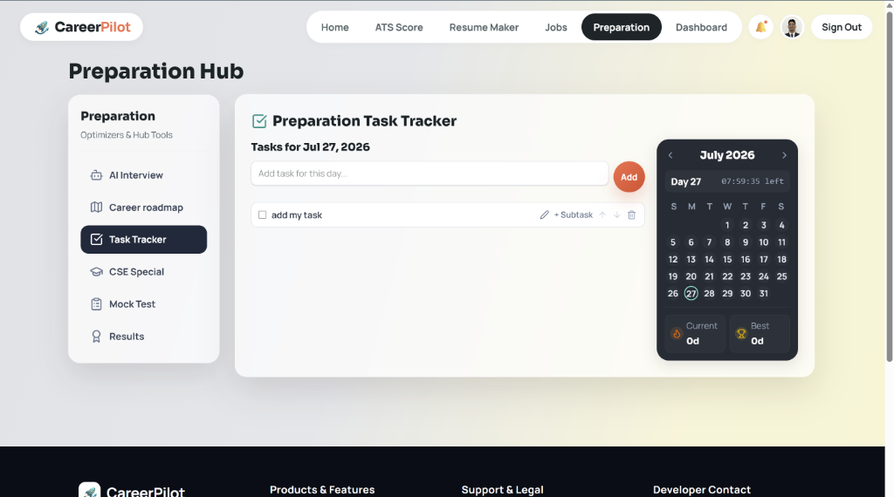
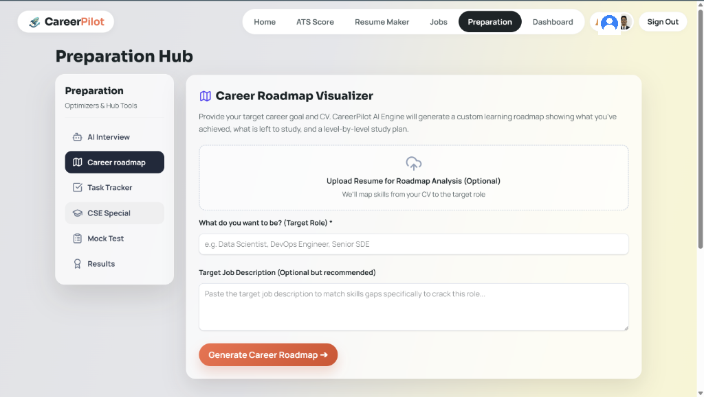

# 🚀 CareerPilot — AI-Powered Candidate Career Acceleration Platform

<p align="center">
  
</p>

<p align="center">
  
  
  
  
  
  
  
</p>

---

<p align="center">
  
</p>

---

## 📖 Table of Contents
- [🌐 Project Overview](#-project-overview)
- [🔗 Live Production URLs & Quick Directory](#-live-production-urls--quick-directory)
- [🌟 Complete Feature Suite & Real UI Screenshots](#-complete-feature-suite--real-ui-screenshots)
- [📸 Application UI Screenshots & Gallery](#-application-ui-screenshots--gallery)
- [🎬 UI Animation & Visual Design Engine](#-ui-animation--visual-design-engine)
- [🏗 System Architecture & Modular Django MTV App Design](#-system-architecture--modular-django-mtv-app-design)
- [🛠 Technology Stack](#-technology-stack)
- [💻 Local Development Setup](#-local-development-setup)
- [☁️ AWS Production Cloud Architecture](#%EF%B8%8F-aws-production-cloud-architecture)
- [🛡️ Production Hardening & Resilience](#%EF%B8%8F-production-hardening--resilience)
- [📜 License & Author](#-license--author)

---

## 🌐 Project Overview

**CareerPilot** is a comprehensive, enterprise-grade **AI candidate career acceleration suite**. It empowers candidates to optimize their job application lifecycle through **ATS resume scorecards**, **executive LaTeX PDF compiling**, **AI voice mock interviews**, **CS core subject trackers**, **career roadmap generation**, and **real-time live job matching**.

Powered by Google's **Gemini AI**, **scikit-learn TF-IDF similarity vectorizers**, and an ultra-fluid **React 19 / Vite 7** frontend, CareerPilot provides instant feedback, bullet point optimization, and candidate scoring.

---

## 🔗 Live Production URLs & Quick Directory

> [!IMPORTANT]
> CareerPilot is deployed 24/7 on AWS EC2 (`t3.small`) backed by a static AWS Elastic IP.

- **Main Domain**: [https://careerpilot.website](https://careerpilot.website)
- **Direct Static IP Access**: [http://15.252.51.16](http://15.252.51.16)

### 📍 Web Application Page Directory

| Feature / Page Module | Production Web URL |
| :--- | :--- |
| **🏠 Home Landing Page** | [https://careerpilot.website/](https://careerpilot.website/) |
| **📊 ATS Resume Screener** | [https://careerpilot.website/upload](https://careerpilot.website/upload) |
| **📄 Executive LaTeX Resume Architect** | [https://careerpilot.website/app/builder/default](https://careerpilot.website/app/builder/default) |
| **🎙️ AI Voice Mock Interview Hub** | [https://careerpilot.website/preparation](https://careerpilot.website/preparation) |
| **🎓 Computer Science Special Hub** | [https://careerpilot.website/preparation](https://careerpilot.website/preparation) |
| ├── **Operating Systems Theory** | [https://careerpilot.website/preparation/theory/OS](https://careerpilot.website/preparation/theory/OS) |
| ├── **DBMS Theory** | [https://careerpilot.website/preparation/theory/DBMS](https://careerpilot.website/preparation/theory/DBMS) |
| ├── **Computer Networks Theory** | [https://careerpilot.website/preparation/theory/CN](https://careerpilot.website/preparation/theory/CN) |
| ├── **System Design Theory** | [https://careerpilot.website/preparation/theory/SystemDesign](https://careerpilot.website/preparation/theory/SystemDesign) |
| └── **OOPs Theory** | [https://careerpilot.website/preparation/theory/OOPs](https://careerpilot.website/preparation/theory/OOPs) |
| **💼 Real-Time Live Job Matcher** | [https://careerpilot.website/jobs](https://careerpilot.website/jobs) |
| **📈 Candidate Scorecard Dashboard** | [https://careerpilot.website/dashboard](https://careerpilot.website/dashboard) |
| **🔐 Login & Authentication** | [https://careerpilot.website/login](https://careerpilot.website/login) |

### 🛠️ Backend API & Admin Endpoints
- **API Health Check**: [https://careerpilot.website/api/health](https://careerpilot.website/api/health)
- **Django Admin Panel**: [https://careerpilot.website/admin/](https://careerpilot.website/admin/)

---

## 🌟 Complete Feature Suite & Real UI Screenshots

### 1. 🎓 Computer Science Special & Top 260 DSA Masterclass Tracker
- **CSE Special Hub**: Dedicated preparation dashboard covering Data Structures & Algorithms (DSA), Object-Oriented Programming (OOPs), Operating Systems (OS), Database Management Systems (DBMS), Computer Networks (CN), and System Design.
- **DSA Sheet Master Tracker**: Real-time progress tracking across 260 curated algorithms with completion metrics and category filters.
- **In-Depth Theory Revision**: High-yield technical pattern breakdowns featuring *Why This Pattern?*, *When to Use*, and *Complexity Reference Cards* ($O(1)$ lookup, $O(N)$ space).
- 📁 **Source Code**: [OsTheory.jsx](file:///c:/Users/Mukund/PycharmProjects/Resume_Screener/client/src/pages/OsTheory.jsx), [DbmsTheory.jsx](file:///c:/Users/Mukund/PycharmProjects/Resume_Screener/client/src/pages/DbmsTheory.jsx), [CnTheory.jsx](file:///c:/Users/Mukund/PycharmProjects/Resume_Screener/client/src/pages/CnTheory.jsx), [SystemDesignTheory.jsx](file:///c:/Users/Mukund/PycharmProjects/Resume_Screener/client/src/pages/SystemDesignTheory.jsx), [OopsTheory.jsx](file:///c:/Users/Mukund/PycharmProjects/Resume_Screener/client/src/pages/OopsTheory.jsx)

<p align="center">
  
</p>

<p align="center">
  
</p>

### 2. 📈 Interactive Candidate Dashboard & Score Analytics
- **Centralized Candidate Scorecard**: Displays historical ATS scores, resume versions, DSA tracker progress, and mock test performances.
- **1-Click Complete PDF Diagnostic Export**: Generates and downloads a complete candidate evaluation report in PDF format.
- 📁 **Source Code**: [dashboard.jsx](file:///c:/Users/Mukund/PycharmProjects/Resume_Screener/client/src/pages/dashboard.jsx)

<p align="center">
  
</p>

### 3. 📄 Executive LaTeX Resume Architect & PDF Compiler
- **Dynamic Template Selection**: Choose from 3 executive LaTeX templates (Data & ML Specialist, Classic Software Engineer, Corporate Modern).
- **AI Keyword Auto-Recommendation**: Generates Stream-specific skills (e.g. Scikit-learn, PyTorch, Feature Engineering, Model Deployment) directly into resume sections.
- **Side-by-Side Code Viewer & Live Compilation**: Real-time LaTeX source code editing with instantaneous PDF compilation.
- 📁 **Source Code**: [ResumeBuilder.jsx](file:///c:/Users/Mukund/PycharmProjects/Resume_Screener/client/src/pages/ResumeBuilder.jsx), [Preview.jsx](file:///c:/Users/Mukund/PycharmProjects/Resume_Screener/client/src/pages/Preview.jsx), [MakerOptions.jsx](file:///c:/Users/Mukund/PycharmProjects/Resume_Screener/client/src/pages/MakerOptions.jsx)

<p align="center">
  
</p>

### 4. 📊 ATS Resume Screener & Skill Alignment Engine
- **Instant Match Scorecard (0–100%)**: Evaluates uploaded `PDF` and `DOCX` CVs against target job descriptions using scikit-learn TF-IDF cosine similarity.
- **ATS Parser Compatibility**: Simulates Workday, Greenhouse, and Lever parsing engines to detect formatting flaws and keyword gaps.
- **Gemini AI Skill Booster**: Recommends missing hard/soft technical skills and contextual action verbs.
- 📁 **Source Code**: [Upload.jsx](file:///c:/Users/Mukund/PycharmProjects/Resume_Screener/client/src/pages/Upload.jsx), [Result.jsx](file:///c:/Users/Mukund/PycharmProjects/Resume_Screener/client/src/pages/Result.jsx), [views.py](file:///c:/Users/Mukund/PycharmProjects/Resume_Screener/backend/api/views.py)

<p align="center">
  
</p>

### 5. 🎙️ AI Voice-Based CV Mock Interviews & Fluency Analytics
- **Speech-to-Text Voice Analytics**: Practice technical & behavioral interview questions with real-time voice speech analytics.
- **Fluency & Accuracy Scoring**: Evaluates candidate confidence, pacing, domain accuracy, and filler words.
- **Automated Roadmap Generator**: Delivers a personalized study plan targeting identified technical weak points.
- 📁 **Source Code**: [Preparation.jsx](file:///c:/Users/Mukund/PycharmProjects/Resume_Screener/client/src/pages/Preparation.jsx), [MockTest.jsx](file:///c:/Users/Mukund/PycharmProjects/Resume_Screener/client/src/pages/MockTest.jsx)

<p align="center">
  
</p>

### 6. 📅 Preparation Task Tracker & Daily Calendar Streaks
- **Interactive Task Management**: Add, organize, and check off daily preparation tasks and subtasks.
- **Calendar & Streak Counter**: Visual calendar widget with daily countdowns, active study streaks, and personal best records.
- 📁 **Source Code**: [Preparation.jsx](file:///c:/Users/Mukund/PycharmProjects/Resume_Screener/client/src/pages/Preparation.jsx)

<p align="center">
  
</p>

### 7. 🗺️ Career Roadmap Visualizer
- **Custom Learning Roadmaps**: AI-powered level-by-level study plan generated from candidate resume analysis and target job goals.
- **Skill Gap Identification**: Maps candidate CV skills directly against target roles (e.g. Data Scientist, DevOps Engineer, Senior SDE).
- 📁 **Source Code**: [Preparation.jsx](file:///c:/Users/Mukund/PycharmProjects/Resume_Screener/client/src/pages/Preparation.jsx)

<p align="center">
  
</p>

### 8. 💼 Real-Time Live Job Matcher & Chatbot Coach
- **100K+ Live Job Index**: Aggregates tech roles updated daily via Arbeitnow & JSearch APIs.
- **AI Career Chatbot**: Interactive coach answering resume questions, tailoring bullets, and guiding interview prep.
- 📁 **Source Code**: [Jobs.jsx](file:///c:/Users/Mukund/PycharmProjects/Resume_Screener/client/src/pages/Jobs.jsx), [Chatbot.jsx](file:///c:/Users/Mukund/PycharmProjects/Resume_Screener/client/src/pages/Chatbot.jsx)

---

## 📸 Interactive Application UI Gallery

> [!NOTE]
> Slide through actual screenshots of CareerPilot modules in action:

```carousel

<!-- slide -->

<!-- slide -->

<!-- slide -->

<!-- slide -->

<!-- slide -->

<!-- slide -->

<!-- slide -->

<!-- slide -->

```

---

## 🎬 UI Animation & Visual Design Engine

The landing page ([Home.jsx](file:///c:/Users/Mukund/PycharmProjects/Resume_Screener/client/src/pages/Home.jsx)) features an executive-grade interactive UI built with modern animation libraries:

- **Framer Motion (`framer-motion`)**: Scroll-triggered transforms (`useScroll`, `useTransform`, `useSpring`), hero element floating, micro-interactions, badge glows, and component entrances.
- **Lenis Smooth Scroll (`lenis`)**: Inertial momentum-based smooth scrolling across all pages.
- **HTML5 Neural Particle Mesh (`ParticleMeshCanvas`)**: Custom HTML5 2D Canvas engine generating an interactive neural particle network that connects nodes dynamically on cursor hover.
- **3D Perspective Tilt Engine (`TiltCard`)**: Custom CSS 3D perspective engine (`perspective(1000px) rotateX(...) rotateY(...) scale3d(...)`) with a specular glare effect following cursor coordinates.
- **Glassmorphic HSL Design System**: Dark/light mode theme engine built with backdrop blur filters (`backdrop-filter: blur()`) and dynamic HSL gradients ([home.css](file:///c:/Users/Mukund/PycharmProjects/Resume_Screener/client/src/css/home.css)).

---

## 🏗 System Architecture & Modular Django MTV App Design

CareerPilot adopts a modular **Django MTV (Model-Template-View)** app architecture decoupled with a modern **React 19 / Vite 7** presentation layer:

```mermaid
flowchart TD
    User([Candidate / Recruiter]) -->|HTTPS Traffic| Nginx[Nginx 1.28.3 Reverse Proxy]
    
    subgraph AWS EC2 Server (t3.small / 2GB RAM / 20GB SSD)
        Nginx -->|Static Assets /assets/| Dist[Client Build /client/dist/]
        Nginx -->|Proxy Pass http://127.0.0.1:8000| Gunicorn[Gunicorn WSGI Application]
        
        subgraph Django MTV Modular Apps
            Gunicorn --> AuthApp[1. auth_app: User Auth, Google SSO & Email OTP]
            Gunicorn --> ScreenerApp[2. screener_app: ATS Resume Analyzer & TF-IDF Vectorizer]
            Gunicorn --> BuilderApp[3. builder_app: LaTeX Resume Architect & PDF Compiler]
            Gunicorn --> InterviewApp[4. interview_app: Voice AI Mock Interview & Coding Evaluator]
            Gunicorn --> LearningApp[5. learning_app: CS Special Hub & Top 260 DSA Tracker]
            Gunicorn --> TrackerApp[6. tracker_app: Candidate Dashboard & Career Roadmap]
        end

        AuthApp & ScreenerApp & BuilderApp & InterviewApp & LearningApp & TrackerApp --> DB[(SQLite / PostgreSQL DB)]
    end
    
    ScreenerApp & InterviewApp & BuilderApp -->|API Calls| Gemini[Google Gemini 2.5 Flash / DeepSeek AI]
    ScreenerApp -->|API Calls| JobAPI[Arbeitnow / JSearch Live Job APIs]
```

### 📦 6 Domain Django MTV Apps Breakdown

| App Name | Path | Purpose & Responsibilities | Key Endpoints |
| :--- | :--- | :--- | :--- |
| **`auth_app`** | `backend/auth_app/` | User Account Registration, Password Hashing, Google SSO, 6-digit Email OTP Verification, Profile Management | `/api/auth/register`, `/api/auth/login`, `/api/auth/verify-otp`, `/api/auth/google` |
| **`screener_app`** | `backend/screener_app/` | ATS Resume Scoring, Hybrid Score Averaging (Model1 TF-IDF + Gemini AI), Missing High-Yield Keyword Extraction | `/api/screener/analyze-resume`, `/api/screener/generate-summary`, `/api/screener/recommend-jobs` |
| **`builder_app`** | `backend/builder_app/` | Executive LaTeX Resume Architect, Live PDF Compilation, DOCX Exporter & Chatbot Resume Assistant | `/api/builder/parse-resume-to-json`, `/api/builder/build-resume`, `/api/builder/download-docx` |
| **`interview_app`** | `backend/interview_app/` | Voice AI Mock Interviewer, Technical Question Generation, Audio Response Grading & Coding Test Evaluator | `/api/interview/interview/start`, `/api/interview/interview/grade`, `/api/interview/mock-test/submit` |
| **`learning_app`** | `backend/learning_app/` | Computer Science Special Hub (OS, DBMS, CN, OOPS, System Design Theory) & Top 260 DSA Masterclass Tracker | `/api/learning/suggest-stream-keywords`, CS Theory Handlers |
| **`tracker_app`** | `backend/tracker_app/` | Central Candidate Dashboard Metrics, Preparation Task Schedule, Overdue Notifications & Career Roadmap | `/api/tracker/dashboard`, `/api/tracker/resumes`, `/api/tracker/interview/roadmap` |

---

## 🛠 Technology Stack

| Layer | Technologies & Tools |
| :--- | :--- |
| **Frontend** | React 19, Vite 7, TailwindCSS 4, Framer Motion, Lenis Smooth Scroll, GSAP, Lucide Icons |
| **Backend** | Python 3.12, Django 5.0 REST Framework, Gunicorn WSGI |
| **AI & Machine Learning** | Google Gemini 2.5 Flash API, `scikit-learn` (TF-IDF vectorizer), `pandas`, `numpy` |
| **Parsing & Compilers** | `pdfplumber`, `PyPDF2`, `python-docx`, `fpdf2`, LaTeX engine |
| **Database** | SQLite (Development) / PostgreSQL (Production) |
| **Cloud & Infrastructure** | AWS EC2 (`t3.small`, 2GB RAM, 20GB SSD), Nginx Reverse Proxy, Static Elastic IP `15.252.51.16` |

---

## 💻 Local Development Setup

### 1. Clone Repository
```bash
git clone https://github.com/mukundkhandelwal463/careerpilot.git
cd careerpilot
```

### 2. Backend Setup (Django)
```bash
# Create Python virtual environment
python -m venv .venv

# Activate environment
source .venv/bin/activate  # On Windows: .venv\Scripts\activate

# Install dependencies
pip install -r backend/requirements.txt

# Create .env file
cp backend/.env.example backend/.env
# Open backend/.env and add your GEMINI_API_KEY

# Run database migrations & start backend server
python backend/manage.py migrate
python backend/manage.py runserver 8000
```

### 3. Frontend Setup (React / Vite)
```bash
cd client
npm install
npm run dev
```
Open [http://localhost:5173](http://localhost:5173) in your browser.

---

## ☁️ AWS Production Cloud Architecture

CareerPilot is deployed on **AWS Cloud** using an optimized, high-availability architecture:

- **Server Instance**: AWS EC2 `t3.small` (2 GB RAM, 20 GB SSD)
- **Static IP**: AWS Elastic IP `15.252.51.16` permanently bound
- **WSGI Server**: Gunicorn 3 workers × 2 threads (`--workers 3 --threads 2 --timeout 120`)
- **Reverse Proxy**: Nginx 1.28.3 with direct static asset caching for `/assets/`
- **Deployment Script**: [ec2-userdata.sh](file:///c:/Users/Mukund/PycharmProjects/Resume_Screener/ec2-userdata.sh)

---

## 🔄 Automated GitHub Actions CI/CD Pipeline

CareerPilot uses an automated **GitHub Actions CI/CD pipeline** ([deploy.yml](file:///c:/Users/Mukund/PycharmProjects/Resume_Screener/.github/workflows/deploy.yml)) triggered on every `git push` to `main`:

```
┌───────────────────────────┐      ┌───────────────────────────┐      ┌───────────────────────────┐
│  1. Checkout & Setup      │ ───> │  2. Test & Build          │ ───> │  3. SSH AWS EC2 Deploy    │
│  (Python 3.12 + Node 20)  │      │  (Django Check + Vite)    │      │  (Pull + Migrate + Reload)│
└───────────────────────────┘      └───────────────────────────┘      └───────────────────────────┘
```

1. **Automated Testing & Build**: Runs Django system diagnostics (`manage.py check`) and compiles the Vite React production bundle.
2. **Zero-Downtime Deployment**: Connects via SSH to your AWS EC2 instance (`15.252.51.16`), pulls the latest code, runs database migrations, builds frontend assets, and smoothly reloads Gunicorn and Nginx.

---

## 🛡️ Production Hardening & Resilience

1. **2 GB Swap Memory Protection**: `/swapfile` enabled to buffer RAM spikes.
2. **Systemd Auto-Recovery**: Configured `Restart=always` with `RestartSec=3` for automatic service recovery.
3. **High File Handle Limits**: Updated `LimitNOFILE=65535` and Nginx `worker_rlimit_nofile 65535` to prevent socket dropouts.
4. **100MB Log Vacuum Capping**: Configured `/etc/systemd/journald.conf` with `SystemMaxUse=100M` to prevent disk bloat.

---

## 📜 License & Author

Distributed under the **MIT License**. See `LICENSE` for details.

**Author**: Mukund Khandelwal ([GitHub Profile](https://github.com/mukundkhandelwal463))  
**Project Repository**: [CareerPilot on GitHub](https://github.com/mukundkhandelwal463/careerpilot)

---

<p align="center">
  <b>Built with ❤️ for candidate career acceleration.</b>
</p>
